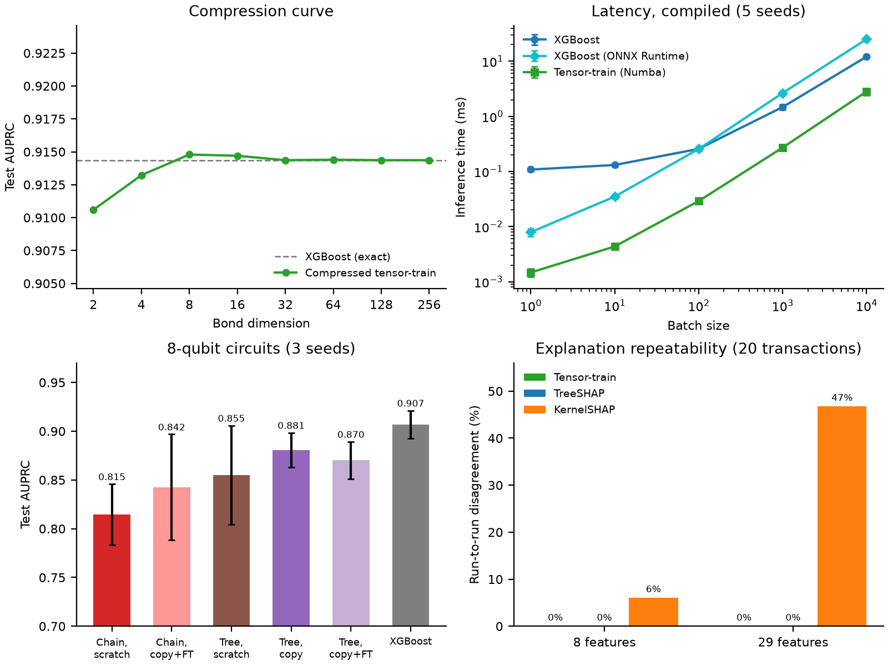

# Exact tensor-network distillation for explainable card-fraud detection

Public repository for the HSBC problem statement of the **2026 Global Quantum + AI
Challenge** (Phase 1 concept proposal, team Quantum Mads). It contains the code,
result tables and tests behind every number in the proposal, on the European
Cardholder (ULB) dataset.

**The idea.** Ensembles of decision trees (XGBoost, Random Forest, CatBoost) are the
industry standard for card-fraud scoring, and a trained tree ensemble is exactly a
tensor network. Every leaf of a
decision tree is an axis-aligned box in feature space and the ensemble's score is a
weighted sum of leaf indicators; binning each feature at the ensemble's own split
thresholds turns that sum into a matrix product state (tensor-train) with one term
per leaf. The conversion is lossless (checked to floating-point precision against
XGBoost; Random Forest and CatBoost are checked in the private repository), nothing is trained from a random start, and the
decision boundary a risk team has already validated is preserved exactly. The
tensor-train then serves as an exact explainer of the ensemble's decisions, as a fast
scorer where a compact model is enough, and as a teacher for a small quantum circuit.

```
trained tree ensemble ──exact──▶ tensor-train ──SVD──▶ compressed tensor-train
                                                          │
                       ┌──────────────────────────────────┼───────────────────┐
                       ▼                                  ▼                   ▼
             inference latency          local explainability        global interpretability
           4.3–8.8× faster than       exact attribution, exact       entanglement entropy:
           XGBoost at 8 features      "what would flip this call"    which signals the model relies on
                       │
                       └──────────▶ warm start for an 8-qubit circuit on Amazon Braket
                                    (tree circuit copied from it: 0.881 ± 0.018, 3 seeds)
```

## What is demonstrated

Every claim maps to one script, one committed result table and (where the claim
is exactness) one test.

| Capability | Result (ULB, test split) | Script | Result table | Test |
|---|---|---|---|---|
| Exact distillation, then compression | bond dimension 4 already matches XGBoost (0.913 vs 0.914 AUPRC); curve flat from 8 | `01_distillation_compression.py` | `distillation_compression.json` | `test_tree_to_tt.py` |
| Bootstrap intervals | paired 95% intervals over test transactions: compressed tensor-train minus XGBoost −0.007 to +0.003 AUPRC (bond 4, reduced sample) and −0.002 to +0.004 (bond 8, 2,052-leaf model); missing-field gain above zero at every rate (0.010–0.042 at 10% up to 0.127–0.191 at 50%) | `14_bootstrap_intervals.py` | `bootstrap_intervals.json` | — |
| Hierarchical conversion | same test AUPRC as the one-step merge at bond 2–16 on the 2,052-leaf model, with 28× less memory for the cores | `11_hierarchical_merge.py` | `hierarchical_merge.json` | `test_hierarchical_merge.py` |
| Warm start and fine-tuning | the compressed network matches XGBoost before any training (within 0.004 AUPRC, above it in 4 of 6 settings; 3 seeds × 2 bond dimensions); fine-tuning never lowers it and adds up to +0.004; the same architecture from a random start reaches 0.05–0.83 | `10_tt_finetune.py` | `tt_finetune_lr0.0002_steps1500_seed{0,1,2}.json` | `test_tt_finetune.py` |
| Inference latency | 8 features, bond 8: tensor-train 4.3–8.8× faster than the faster XGBoost path at every batch size 1–10,000, compiled against compiled (Numba vs stock / ONNX Runtime XGBoost; 5 seeds, one core, different rows each repeat) | `12_compiled_latency.py` | `latency_compiled.json` | `test_fast_contraction.py` |
| Exact per-transaction attribution | one masked contraction per feature, batched, deterministic; compared with TreeSHAP and KernelSHAP | `03_attribution_benchmark.py` | `attribution_benchmark.json` | `test_attribution.py` |
| KernelSHAP instability scales with feature count | 6% run-to-run instability at 8 features vs 47% at 29 (same sample, same 200-sample budget) — the tensor-train's exact attribution has no such degradation | `09_attribution_full_scale.py` | `attribution_full_scale.json` | `test_attribution.py` |
| Missing fields, exact expectation | +0.025 / +0.065 / +0.087 / +0.159 AUPRC over XGBoost's native handling at 10 / 20 / 30 / 50 % missing | `04_missing_fields.py` | `missing_fields.json` | `test_tree_to_tt.py` |
| Exact decision-boundary sensitivity | for the 15 transactions nearest the threshold, 2 flip under a single-bin move, both correcting a model error | `05_boundary_sensitivity.py` | `boundary_sensitivity.json` | `test_boundary_sensitivity.py` |
| Global interpretability (entropy) | real three-model stack 0.47–0.60 nats, between "dominated by one model" (0.14–0.32) and "genuine blend" (0.69–0.71) | `06_entropy_calibration.py` | `entropy_calibration.json` | `test_stack_entropy.py` |
| Warm-started quantum circuit | 3 seeds (XGBoost 0.907): from scratch, chain 0.815 ± 0.031 and tree 0.855 ± 0.051; copying the tensor-train into the tree circuit gives 0.881 ± 0.018 (logit correlation with the teacher 0.89; fine-tuning adds nothing, 0.870 ± 0.019), into the chain only 0.810 ± 0.035 (correlation 0.75; fine-tuned 0.842 ± 0.054) | `07_circuit_distillation.py`, `13_circuit_warmstart_topologies.py` | `circuit_distillation*.json`, `circuit_warmstart_seed{0,1,2}.json` | `test_circuit_distillation.py` |
| Circuit topology | tree circuit (depth 10 vs 22 for the chain) trained from scratch: 0.924 on seed 0, 0.855 ± 0.051 over three seeds | `08_circuit_topologies.py`, `13_circuit_warmstart_topologies.py` | `circuit_topologies.json`, `circuit_warmstart_seed{0,1,2}.json` | `test_braket_tree_circuit.py` |



## 1. Exact distillation and compression

`qdistill/tree_to_tt.py` converts an XGBoost booster into a tensor-train over the
ensemble's own bin edges: one rank-1 term per leaf, merged as a direct sum
(`tt_merge.merge_mps_sum`) so the bond dimension equals the leaf count. On the
reduced 8-feature sample used throughout (60 fraud + 940 legitimate training rows,
20 + 380 validation and test rows, fraud enriched to 6 % / 5 % so that small-sample
metrics are not noise) the 300-tree model has 1,522 leaves and the converted
tensor-train reproduces its margin to within 1e-5. `tt_merge.svd_compress` then
canonicalises and truncates each bond (optimal bond by bond, with the discarded weight
reported per bond): bond dimension 4 already recovers XGBoost's accuracy and the
curve is flat from 8. On a larger, properly powered setting (2,000 training rows,
2,052 leaves, evaluated on every fraud case of the validation and test splits) the
curve is flat from bond dimension 2 (`04_missing_fields.py`, `compression_curve`).

### Hierarchical conversion

The one-step merge holds every leaf as a separate term, so its memory grows
with the square of the leaf count. `qdistill/hierarchical_merge.py` converts
an ensemble in clusters of trees (sharing one set of bin edges), compresses
each cluster, then merges compressed clusters pairwise and compresses again up
a binary tree; with no truncation it is the same tensor-train
(`test_hierarchical_merge.py`). On the 2,052-leaf model
(`11_hierarchical_merge.py`): 15 clusters and 4 merge levels give the same test
AUPRC as the one-step merge at bond 2, 4, 8 and 16, holding at most 0.18 GB of
cores at once against 4.95 GB. Applying it to production-size models is
Phase 2 work.

### Warm start and fine-tuning

Because the compressed tensor-train is an ordinary trainable network, it can be
fine-tuned with gradient descent from where the conversion leaves it.
`10_tt_finetune.py` wraps the compressed cores in a tensorkrowch MPS (the
warm start is exact: `test_tt_finetune.py`), fine-tunes on the training
rows with Adam (lr 2e-4, 1,500 steps, checkpoint chosen on validation AUPRC),
and trains the same architecture from two random initialisations under the
same budget. Three seeds, each with its own feature selection and sample:

| seed | XGBoost | bond 4: step 0 → fine-tuned | bond 8: step 0 → fine-tuned | random start (randn_eye / identity) |
|---|---|---|---|---|
| 0 | 0.9144 | 0.9132 → 0.9172 | 0.9148 → 0.9156 | 0.24–0.45 / 0.72–0.83 |
| 1 | 0.9196 | 0.9227 → 0.9227 | 0.9193 → 0.9193 | 0.05–0.23 / 0.60–0.69 |
| 2 | 0.8869 | 0.8892 → 0.8892 | 0.8870 → 0.8898 | 0.07–0.20 / 0.52–0.54 |

What is robust: the converted network is as good as XGBoost with no training
at all (within 0.004 AUPRC, above it in four of six settings), and fine-tuning
never lowers it; five of the six fine-tuned networks end at or above XGBoost. What is not:
the size of the fine-tuning gain, which is zero in half the settings and at
most +0.004 AUPRC, within the noise of a 20-fraud test sample. A random start
never reaches the ensemble under the same budget; how far below it lands
depends on the initialisation scheme.

## 2. Inference latency

Because the embedding is one-hot, contracting a core against it is a gather of a
single slice (`fast_contraction.contract_chain_numpy_gather`): scoring is a
handful of small matrix products per transaction with no tree traversal.

`12_compiled_latency.py` compares compiled against compiled, as a production
team would deploy: XGBoost through its own predictor and through ONNX Runtime
(onnxmltools), the tensor-train as an ONNX graph on the same engine and as a
Numba loop, all from raw features on one core, every compiled path checked
against its plain counterpart (max probability difference below 3e-6). Each
timed repeat scores different rows of a 10,000-row test pool, so no model
reuses the previous repeat's rows from cache. 8-feature models (bond 8), five
independently trained seeds, ms per batch:

| batch | XGBoost | XGBoost (ONNX) | TT (NumPy) | TT (ONNX) | TT (Numba) | faster XGBoost / TT (Numba) |
|---|---|---|---|---|---|---|
| 1 | 0.108 | 0.0079 | 0.089 | 0.016 | 0.0015 | 5.4× |
| 10 | 0.131 | 0.035 | 0.093 | 0.031 | 0.0044 | 8.0× |
| 100 | 0.257 | 0.256 | 0.128 | 0.136 | 0.029 | 8.8× |
| 1,000 | 1.47 | 2.65 | 0.58 | 1.24 | 0.27 | 5.4× |
| 10,000 | 12.1 | 25.2 | 4.73 | 13.9 | 2.82 | 4.3× |

The tensor-train is 4.3–8.8× faster than the faster XGBoost path at every
batch size. Its cost per transaction grows with the number of features times
the square of the bond dimension, whereas a tree ensemble's grows only with its
trees, so the advantage belongs to compact scorers and has to be re-established
at production feature counts; where it does not hold, XGBoost stays the scorer
and the tensor network explains its decisions. For context, an authorisation
must complete in 100–300 ms end to end, of which the card network alone takes
~130 ms. `02_latency_benchmark.py` is an earlier, uncompiled benchmark (stock
XGBoost against the NumPy tensor-train), kept for reference.

## 3. Local explainability

The tensor-train is linear in each feature's embedding, so three questions have
exact, sampling-free answers, each as one contraction against a modified embedding
(`qdistill/attribution.py`, `tree_to_tt.predict_logit_with_missing_bins`,
`qdistill/boundary_sensitivity.py`):

- **Attribution.** Replace one feature's embedding by its training-marginal
  embedding and re-contract: the exact drop in logit is that feature's
  contribution, batched over all transactions being explained.
  `03_attribution_benchmark.py` compares this with XGBoost's TreeSHAP (also exact)
  and with KernelSHAP on a standalone MLP (sampling-based; run twice to measure
  run-to-run instability at a fixed 200-sample budget): 6% instability at the 8
  selected features. `09_attribution_full_scale.py` asks whether that number is
  about the model or about how many features KernelSHAP has to cover: holding
  everything else fixed and using all 29 features, instability rises to 47%,
  because 200 samples cover 78% of the 2⁸ feature coalitions at 8 features but a
  vanishing 4×10⁻⁵% of the 2²⁹ coalitions at 29 — a gap that gets worse exactly
  where it matters most, since HSBC's own primary (IEEE-CIS) dataset has up to
  393 features. The tensor-train's exact attribution shows no such degradation
  (rank agreement with TreeSHAP stays at 0.80–0.82 at both scales). See
  `results/tables/attribution_benchmark.json` and `attribution_full_scale.json`.
- **Missing fields.** The same substitution is an exact expectation over the
  reference distribution, in one contraction regardless of how many fields are
  missing. `04_missing_fields.py` masks features at 10–50 % (five mask seeds) and
  compares with XGBoost's native default-direction handling on the same masked
  rows: +0.025 / +0.065 / +0.087 / +0.159 AUPRC.
- **Boundary sensitivity.** The model is piecewise constant on the ensemble's own
  bins, so the exact effect of moving any feature into its neighbouring bin is one
  contraction. `05_boundary_sensitivity.py` reports, for the 15 transactions
  closest to the tuned decision threshold, the required logit move and the largest
  available single-bin move: 2 of 15 flip (a right-ward move of `V4` supplying 0.514
  logits against a gap of 0.019; a right-ward move of `V14` by 0.23 units supplying
  1.754 against a gap of 0.494), and both flips correct a model error.

## 4. Global interpretability

The entanglement entropy at a bond of the tensor-train (`tt_merge.entropy_per_cut`,
the entropy of the singular-value spectrum that compression truncates) measures how
much information the model routes between the feature groups on either side. It is
a property of the fitted model, and it can be calibrated. `06_entropy_calibration.py`
converts the meta-learner of a three-model stack (XGBoost + Random Forest +
CatBoost, shallow-GBM combiner) into its exact 3-site tensor-train
(`qdistill/stack_entropy.py`) and reads the entropy at its two cuts, next to two
synthetic stacks built the same way: one whose label is the majority vote of three
experts that each see disjoint features (a genuine blend), one whose label depends
on a single expert. The real stack sits at 0.47–0.60 nats, between 0.14–0.32
(dominated) and 0.69–0.71 (genuine blend): closer to "trust one model and adjust at
the margins" than to a blend, which its meta-learner's own structure confirms.

## 5. Research line: warm-starting a quantum circuit

Training a variational circuit from a random initialisation is the hard part of
quantum machine learning at this scale. The compressed tensor-train is a teacher
that already encodes an audited decision boundary. `07_circuit_distillation.py`
angle-encodes the 8 selected features on 8 qubits, applies seven four-parameter
entangling blocks along a chain and a Pauli-Z readout with an affine logit, first
regresses the circuit's logit onto the teacher's, then fine-tunes on the labels;
inference is verified on Amazon Braket's local simulator via PennyLane. Same
architecture and budget, over three seeds (each with its own feature
selection and sample; `QDISTILL_SEED=1`, `2`):

| seed | from scratch | warm-started | XGBoost | teacher |
|---|---|---|---|---|
| 0 | 0.8131 | 0.9074 | 0.9144 | 0.9148 |
| 1 | 0.8536 | 0.8456 | 0.9196 | 0.9193 |
| 2 | 0.7774 | 0.7744 | 0.8869 | 0.8870 |

The warm start lifts the chain circuit on seed 0 and not on seeds 1 and 2.
`13_circuit_warmstart_topologies.py` explains why and tries the tree topology
(entangling blocks in a binary-tree pattern, depth 10 rather than 22), logging
how well each circuit copies the teacher before any fine-tuning. Three seeds,
test AUPRC (XGBoost 0.907 ± 0.014):

| circuit | from scratch | copied from the teacher | copied, then fine-tuned | logit correlation with the teacher |
|---|---|---|---|---|
| chain (depth 22) | 0.815 ± 0.031 | 0.810 ± 0.035 | 0.842 ± 0.054 | 0.75 |
| tree (depth 10) | 0.855 ± 0.051 | 0.881 ± 0.018 | 0.870 ± 0.019 | 0.89 |

The deep chain copies only part of the teacher, so it starts no better than a
random initialisation and fine-tuning helps on one seed of three. The shallow
tree circuit copies it well, and the copy alone is the most accurate and least
seed-dependent circuit; fine-tuning on the labels adds nothing to it. The tree
circuit trained from scratch reaches 0.924 on seed 0 but varies widely across
seeds. Pretraining circuits from tensor networks is an established route around
barren plateaus (Huggins et al. 2019; Dborin et al. 2022; Rudolph et al. 2023); what
is new here is that the teacher is an exact image of the production model rather
than a separately trained surrogate.

## Honest limits

- **Scale.** Every result uses the disclosed 8-feature samples, except the
  attribution-stability comparison, which also uses all 29 features. The one-step
  exact merge's memory grows with the square of the leaf count, so a 300-tree
  model on all 29 features (7,273 leaves) is out of its reach (an estimated
  550 GB); the hierarchical merge is validated on the 2,052-leaf model, and
  applying it at production size is Phase 2 work. Larger feature counts are
  expected to need larger bond dimensions.
- **Sampling.** The circuit experiments use a stratified sample with fraud
  enriched to 6 % (stated in every result table) rather than the dataset's 0.172 %;
  Phase 2 adopts ratio-preserving stratified subsampling for hardware runs. The
  reduced test sample has 20 fraud cases, so absolute AUPRC there is uncertain
  (XGBoost's 95% bootstrap interval is 0.79–1.00); paired comparisons on the
  same rows are tight (`14_bootstrap_intervals.py`).
- **Hardware.** All circuit results are on the local simulator; no managed
  simulator or QPU job has been run yet. Circuit results cover three seeds on a
  20-fraud test sample.
- **Latency** is measured on one core. The tensor-train's advantage is shown
  for compact (8-feature) models; because its cost grows with the number of
  features times the square of the bond dimension, it has to be re-established
  at production feature counts. Multi-thread and GPU benchmarks are not
  reported.

## Repository layout

```
src/qdistill/
    tree_to_tt.py              exact XGBoost -> tensor-train conversion, one-hot bin embedding,
                               missing-field marginalisation (reference embedding, masked contraction)
    tt_merge.py                direct-sum merge, canonicalisation, SVD compression, entropy per cut
    hierarchical_merge.py      clustered exact conversion: memory bounded by the largest cluster
    fast_contraction.py        pure-numpy dense and gather contractions (latency path)
    attribution.py             exact per-feature attribution (batched masked contraction)
    boundary_sensitivity.py    exact single-bin decision-boundary sensitivity
    stack_entropy.py           meta-learner -> exact 3-site tensor-train (reads the true base_score)
    braket_tree_circuit.py     chain and tree-topology circuits, training loop, teacher pretraining
    mlp_baseline.py            the neural-network competitor used for the KernelSHAP comparison
    data.py, preprocessing.py, metrics.py, config.py
scripts/
    00_prepare_data.py ... 14_bootstrap_intervals.py   one experiment per reported result
    make_figures.py            regenerates figures/results.png from results/tables/*.json
results/tables/                committed JSON result tables (the source of every number above)
tests/                         exactness and mechanism tests (see the table at the top)
LICENSE, NOTICE                Apache License 2.0 and copyright notice
```

## Reproducing

```bash
uv sync
# Download creditcard.csv from kaggle.com/datasets/mlg-ulb/creditcardfraud into data/raw/
uv run python scripts/00_prepare_data.py
uv run pytest tests/                                   # exactness and mechanism tests
uv run python scripts/01_distillation_compression.py   # ~1 min
uv run python scripts/02_latency_benchmark.py          # ~5 min, 5 seeds
uv run python scripts/03_attribution_benchmark.py      # ~3 min (trains the MLP competitor)
uv run python scripts/04_missing_fields.py             # ~7 GB RAM for the 2,052-leaf exact merge
uv run python scripts/05_boundary_sensitivity.py
uv run python scripts/06_entropy_calibration.py
uv run python scripts/07_circuit_distillation.py       # local Braket simulator
uv run python scripts/08_circuit_topologies.py         # local Braket simulator
uv run python scripts/09_attribution_full_scale.py     # ~20 min (trains an MLP + KernelSHAP at 29 features)
uv run python scripts/10_tt_finetune.py                # ~5 min (fine-tuning + random-init control)
uv run python scripts/11_hierarchical_merge.py         # ~6 min, ~6 GB (runs the one-step merge too)
uv run python scripts/12_compiled_latency.py           # ~6 min, 5 seeds
uv run python scripts/13_circuit_warmstart_topologies.py --seed 0   # ~1.7 h per seed (1, 2 for repeats); local Braket simulator
uv run python scripts/14_bootstrap_intervals.py        # ~4 min, ~7 GB (rebuilds the models of scripts 01 and 04)
uv run python scripts/make_figures.py
```

Every script writes its JSON table to `results/tables/`; the committed tables let
the figure be regenerated without re-running anything. Seeds are fixed (0) and the
sampling used by each experiment is stated in its docstring and in its output.

## Scope

This is a curated subset of a larger private research repository, prepared for the
Phase 1 submission. Further work documented privately and available on request:
generalising the exact distillation to Random Forest, CatBoost and multi-model
stacks (linear and non-linear meta-learners), group and pairwise interaction
attribution, multi-seed tree-versus-chain entanglement analyses, and the
characterisation of where exact merging stops being tractable.

Nothing in the construction is specific to fraud: any tree ensemble a bank already
runs, in anti-money-laundering alerting, credit decisioning or collections, converts
the same way and inherits the same explanation and warm-start properties.

## Data and attribution

Dataset: A. Dal Pozzolo, O. Caelen, R. A. Johnson and G. Bontempi, "Calibrating
probability with undersampling for unbalanced classification," IEEE SSCI 2015.
European Cardholder dataset, Open Database License; not redistributed here.

## License

Code licensed under the [Apache License 2.0](LICENSE); see [NOTICE](NOTICE).
Copyright 2026 Quantum Mads. The dataset is not covered by this licence (see above).
